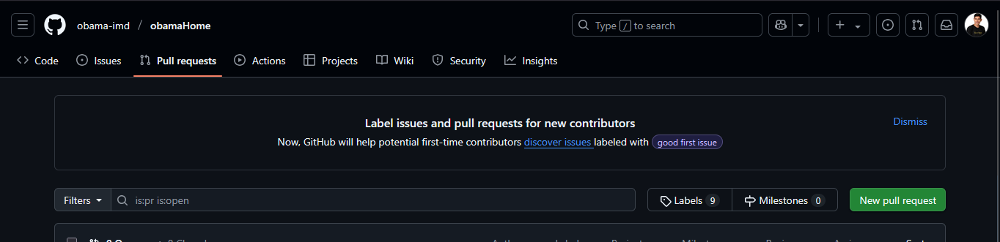
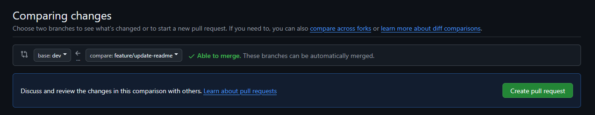
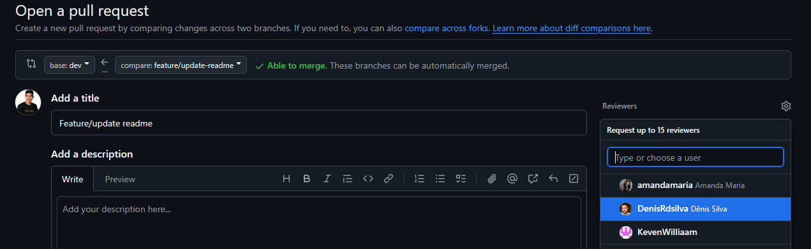

# Obama-front-end

Projeto flutter para a nova interface da plataforma Obama-IMD.
- [Obama web](https://obama.imd.ufrn.br/)

## 🚀 Git Flow - Como trabalhamos com Git no projeto

Para manter a organização, rastreabilidade e qualidade do código, seguimos um fluxo de trabalho bem definido com Git. Abaixo está o passo a passo que deve ser seguido sempre que houver uma nova tarefa.

##  Passo a passo
### 1. 🔁 Voltar para a branch dev

Antes de começar qualquer tarefa, volte para a branch de desenvolvimento principal e atualize:
```sh
git checkout dev
```
```sh
git pull origin dev
```
Isso garante que você está trabalhando com a versão mais atualizada do projeto.

### 2. 🌱 Criar uma nova branch
Crie uma nova branch a partir da `dev`, usando o padrão abaixo para nomeação:
| Tipo	| Prefixo	| Quando usar |
|-------|-----------|-------------|
|Funcionalidade nova|	``feature/``	| Para novas funcionalidades |
|Melhoria |	``improvement/``	| Para melhorias em algo já existente |
|Correção |	``fix/``	| Para pequenas correções pontuais |
|Bug | 	``bug/``	| Para correções de bugs |

```sh
git checkout -b feature/task-name
```
EXEMPLO:
```sh
git checkout -b feature/login-page
```

### 3. 🛠️ Implementar a tarefa
Implemente sua tarefa normalmente. Faça commits com mensagens claras:
```sh
git add nome_do_arquivo
```
OU, para todos adicionar todos os arquivos alterados
```sh
git add .
```
```sh
git commit -m "Create login page"
```

### 4. 📤 Subir a branch para o repositório remoto
```sh
git push origin feature/task-name
```
### 5. 🔀 Abrir um Pull Request
No Repositorio do projeto no [GitHub](https://github.com/obama-imd/obamaHome/) :
-  Abra um Pull Request:  `New pull request`.



-  Selecione a branch `dev` e `Create Pull Request`.



- Adicione o título e marque um membro da equipe como revisor.



- `Create Pull Request ` e Aguarde a revisão e aprovação.

### 6. ✅ Após a aprovação
A branch poderá ser mesclada na `dev` somente após a aprovação do revisor responsável.

## 🧠 Por que seguimos esse fluxo?

### 1. 🔄 Garante que todos trabalhem sobre a mesma base atualizada (dev)

### 2. 🧭 Mantém o repositório organizado com nomes de branches descritivos e padronizados

### 3. 🔍 Facilita a revisão e o rastreamento de mudanças

### 4. 🚀 Permite integração contínua e deploy automatizado

### 5. 👥 Incentiva a colaboração e aprendizado entre os membros da equipe